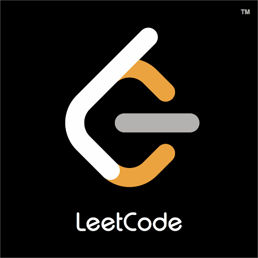

# CodeQuery — DSA Search Engine

 *(Preview placeholder)*

**[Live Demo: codequery-dun.vercel.app](https://codequery-dun.vercel.app/)**

CodeQuery is a blazingly fast, full-stack Natural Language Processing (NLP) search engine designed to discover Data Structures and Algorithms (DSA) problems across the most popular competitive programming platforms: **LeetCode**, **Codeforces**, and **AtCoder**.

## ✨ Features

- **Massive Database:** Scrapes and indexes over **26,000+** coding problems in minutes.
- **Smart NLP Search:** Implements a custom in-memory search engine utilizing Term Frequency-Inverse Document Frequency (TF-IDF) and Cosine Similarity (via the `natural` library) to map concept queries (e.g., *"binary search"*, *"two pointers"*) to exact algorithmic problems.
- **GraphQL & DOM Bypasses:** Cleverly bypasses Cloudflare protections using Puppeteer to intercept internal GraphQL queries on LeetCode for lightning-fast metadata extraction.
- **Split-Stack Deployment:** The frontend is statically hosted on the Vercel Edge Network, while the heavy NLP backend is hosted independently on Render.
- **Zero-Downtime Indexing:** Background index generation allows the REST API to start up instantly and process incoming traffic while compiling the 26,000+ vector mathematical matrix in the background.

## 🛠️ Tech Stack

- **Frontend:** Vanilla HTML5, CSS3, JavaScript (Deployed on **Vercel**)
- **Backend:** Node.js, Express.js (Deployed on **Render**)
- **Search Engine:** `natural` (NLP, TF-IDF vectorization, Cosine Similarity)
- **Web Scraping:** Puppeteer (Headless Chromium)

## 📋 Prerequisites

- **Node.js** (v18+ recommended)
- **npm** (Node Package Manager)

## 🚀 Local Development

### 1. Installation
Clone the repository and install dependencies:
```bash
git clone https://github.com/Kgpianghosh006/Codequery.git
cd Codequery
npm install
```

### 2. Scraping and Building the Corpus
Fetch the latest problems, topic tags, and their descriptions to build the local search corpus. This script safely queries LeetCode, Codeforces, and AtCoder without getting rate-limited.

```bash
# Build the massive JSON corpus (Takes ~5 minutes for 26,000+ problems)
npm run build:corpus
```
*(Note: To limit the number of problems processed during testing, you can use the limit flag: `node scripts/build_corpus.js --limit 50`)*

### 3. Running the Backend Server
Start the Express API server:
```bash
node backend/server.js
```
The server will start on port `5000` and begin building the NLP vector index in the background. Wait for the `Index is ready` log.

### 4. Running the Frontend
In a separate terminal, serve the frontend:
```bash
npx serve frontend
```
Open `http://localhost:3000` in your browser. The `config.js` file will automatically detect you are running locally and route API calls to `localhost:5000`.

## 📡 API Reference

### `POST /search`
Searches the mathematical vector space for relevant DSA problems based on your natural language query.

**Request Body (JSON):**
```json
{
  "query": "binary search tree traversal",
  "platform": "all" // Optional: "LeetCode", "Codeforces", "AtCoder", or "all"
}
```

**Response:**
- `200 OK`: Returns the top 10 ranked results based on cosine similarity.
  ```json
  {
    "results": [
      {
        "id": "two-sum",
        "title": "Two Sum",
        "url": "https://leetcode.com/problems/two-sum",
        "description": "Given an array of integers nums and an integer target...",
        "platform": "LeetCode",
        "difficulty": "Easy",
        "tags": ["Array", "Hash Table"],
        "score": 0.8415
      }
    ]
  }
  ```
- `503 Service Unavailable`: Returned if the TF-IDF search matrix is still compiling.
- `400 Bad Request`: Returned if the query payload is missing.

## 🤖 Deployment Architecture
- **Vercel (Frontend):** Root directory is set to `frontend/`. Optimized with `vercel.json` for aggressive edge caching.
- **Render (Backend):** Root directory is set to `backend/`. Includes specialized health checks (`/health`) and event-loop yielding to prevent Node.js from failing Render's TCP port scans during heavy matrix computations. A `cron-job.org` worker pings the API every 14 minutes to prevent free-tier cold starts.

---
&copy; 2026 CodeQuery — Developed by [Avik Ghosh](https://github.com/Kgpianghosh006)
